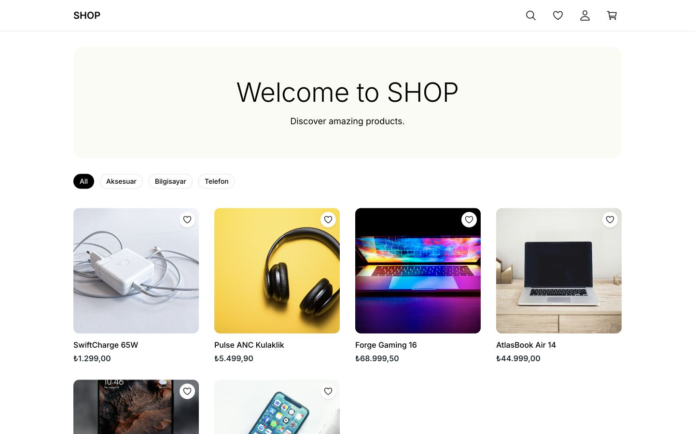
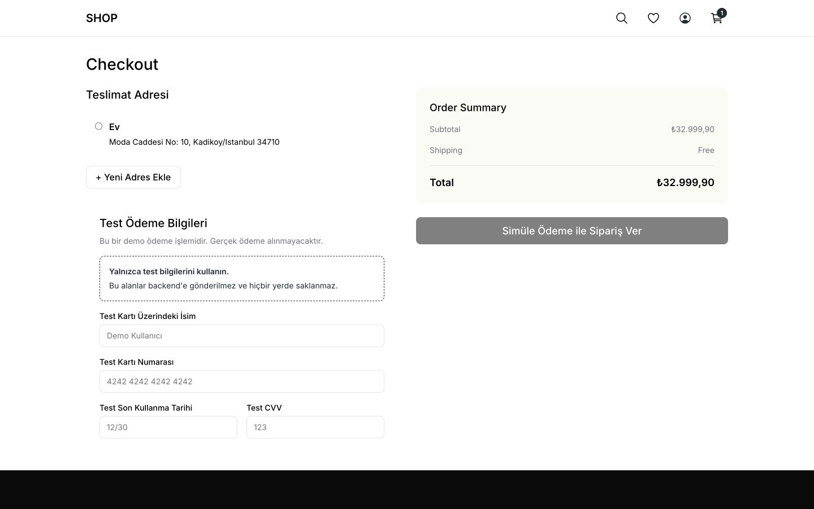
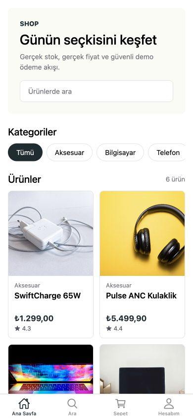
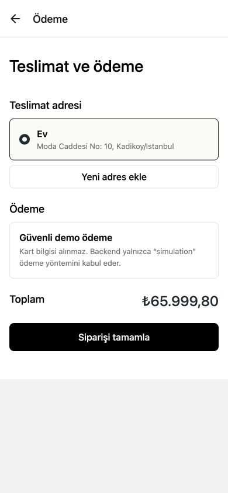

# Staj Ödev Repo Ana Sayfası

Bu repository, **VB10 Staj programı** kapsamında stajyerlere ödevler vermek ve ödev teslim süreçlerini yönetmek amacıyla oluşturulmuştur. Aktif dönem: **2026**.

## Amaç

- Stajyerlere çeşitli yazılım ve proje ödevleri sağlamak.
- Teslim edilen ödevlerin takibini ve değerlendirmesini kolaylaştırmak.
- Staj sürecinde öğrenmeyi ve gelişimi teşvik etmek.

> 🚀 **Yeni misin?** Hangi projeyi seçeceğine ve neye ihtiyacın olduğuna karar vermek için önce → [**HOW-TO rehberi**](./HOW-TO.md)

## 2026 Projeleri

Bu sene 3 yol var: iki yeni proje ve geçen seneden 2026 standartlarına yükseltilmiş projeler. Hepsinde ortak yaklaşım: **çok rollü takım çalışması** (PM · Design · Backend · Frontend · Mobil · QA), **AI destekli tasarım** (Google Stitch + Claude) ve son aşamada **kendi skill/agent'larınızı üretmek**.

### 🛒 [E-Ticaret Uygulaması](./source/ecommerce_project.md) — Ana Proje

**Süre:** 2 hafta · **Roller:** PM · Design · Backend · Frontend · Mobil · QA

Tasarımdan teste uçtan uca gerçek bir ürün: ürün listeleme/arama, sepet, checkout, sipariş. Tasarım Google Stitch + Claude ile, backend/frontend teknolojilerini ekip kendi seçer, QA test yazar, PM projeyi yönetir.

### 🧩 [StackShare Replica](./source/replica_project.md)

**Süre:** 1–2 hafta · **Odak:** Sistem mimarisi

[StackShare](https://stackshare.io)'den gerçek bir sistem (ör. [Uber](https://stackshare.io/uber-technologies/uber)) seçip çekirdek akışının çalışan bir MVP'sini üretmek. Mimari kararları ve trade-off'ları öğrenmek.

### ⬆️ Upgrade Projeleri (2026 sürümü)

- 📋 [**Login Sistemi**](./source/login_project.md) — refresh token, güvenlik, otomatik test. *(Isınma projesi.)*
- 🐾 [**Pet Store**](./source/pet_store_project.md) — RAG tabanlı AI, modern mimari, QA. Referans: [Swagger Petstore](https://petstore.swagger.io/).

### 🤖 [Ortak Son Aşama: Kendi Skill & Agent'larınız](./source/team_skills_agents.md)

Hangi projeyi seçerseniz seçin, geliştirme akışınızdaki tekrarları birer **skill / slash command / agent** haline getireceksiniz. 2026'nın anahtar becerisi: AI'ı kullanan değil, **AI aracını üreten** olmak.

## Ödev Teslim Süreci

Her proje iki adımla tamamlanmış sayılır: **demo videosu** + **kod teslimi**. Detaylı seçim rehberi için → [HOW-TO](./HOW-TO.md).

### 📹 1. Demo Videosu (zorunlu)

- Projenizin çalışan halini anlatan bir **demo videosu** çekin.
- Videoyu **kendi YouTube kanalınızda** yayınlayın ve linkini `README` + PR/issue açıklamanıza ekleyin.
- İçerik: ne yaptığınız, teknoloji seçim gerekçeleriniz ve ana akışın canlı çalışması.

### 🔀 2. Kod Teslimi (PR veya Issue)

Bu repoyu **clone/fork** edip projenizi tamamladıktan sonra iki yöntemden biriyle teslim edin:

- **Fork + Pull Request:** Fork'layın, geliştirin, yaptığınız işi anlatan bir **PR** açın. *(Farklar PR'da net görünür — önerilen yöntem.)*
- **Issue:** Yeni bir **issue** açıp kodunuzu, linklerinizi ve demo videosunu paylaşarak projeyi anlatın.

## İletişim ve Destek

Herhangi bir sorunuz olursa GitHub Issues üzerinden soru sorabilir ya da PR açıklamasında belirtebilirsiniz.

---

**Başarılar!**

## Bu Repodaki E-Ticaret Uygulaması

Takım uygulaması artık tek backend'i kullanan web ve Expo mobil istemcilerinden oluşur. Ürün, sepet, kullanıcı, favori, adres ve sipariş akışları gerçek FastAPI endpointlerine bağlıdır.

| Parça | Başlangıç rehberi |
| --- | --- |
| Backend + Swagger + Docker | [`backend/README.md`](./backend/README.md) |
| Web | [`frontend/web/README.md`](./frontend/web/README.md) |
| Mobil | [`frontend/mobile/README.md`](./frontend/mobile/README.md) |
| Frontend API teslim rehberi | [`backend/docs/FRONTEND_HANDOFF.md`](./backend/docs/FRONTEND_HANDOFF.md) |
| QA raporu | [`backend/qa/TEST_REPORT.md`](./backend/qa/TEST_REPORT.md) |
| Özel skill ve agent | [`SKILLS.md`](./SKILLS.md) |
| PM planı, board ve retrospektif | [`PM_NOTES.md`](./PM_NOTES.md) |
| Lighthouse raporu | [`docs/LIGHTHOUSE_REPORT.md`](./docs/LIGHTHOUSE_REPORT.md) |
| Teslim PR açıklaması | [`PR_DESCRIPTION.md`](./PR_DESCRIPTION.md) |

Backend'i Docker ile başlattıktan sonra web ve mobil istemciler varsayılan olarak `http://localhost:8000` adresindeki aynı API'yi kullanır. Demo hesabı: `demo@eticaret.com` / `DemoPass123`.

Tüm hızlı kabul kontrolleri:

```bash
bash .claude/skills/integration-qa/scripts/run-integration-qa.sh
```

## Uygulama Görüntüleri

| Web ana sayfa | Web checkout |
| --- | --- |
|  |  |

| Mobil ana sayfa | Mobil checkout |
| --- | --- |
|  |  |

Bu görüntüler mock veriyle değil, izole ve seed edilmiş FastAPI backend'ine bağlı çalışan uygulamadan alınmıştır.

## API Tiplerini Yenileme

Web ve mobil API tipleri [`backend/openapi.json`](./backend/openapi.json) sözleşmesinden `openapi-typescript` ile üretilir:

```bash
cd tools/api-contract
npm ci
npm run generate
```

Üretilen dosyalar:

- `frontend/web/src/types/openapi.d.ts`
- `frontend/mobile/src/types/openapi.d.ts`

CI içindeki `contract` işi bu komutu yeniden çalıştırır ve üretilen tiplerde takip edilmeyen bir fark varsa build'i durdurur.

## Teslim Durumu

- Tamamlandı: Swagger/OpenAPI, Docker, seed, gerçek web ve mobil API entegrasyonu, kritik checkout akışları, otomatik backend/web/mobil/E2E testleri, CI, ekran görüntüleri, PM notları ve özel skill/agent.
- Takım tarafından eklenecek: Figma dosyasının paylaşım bağlantısı ve YouTube demo videosu bağlantısı.
- Upstream teslim PR'ı: [VB10/staj-2026-intern-assignments#34](https://github.com/VB10/staj-2026-intern-assignments/pull/34)
